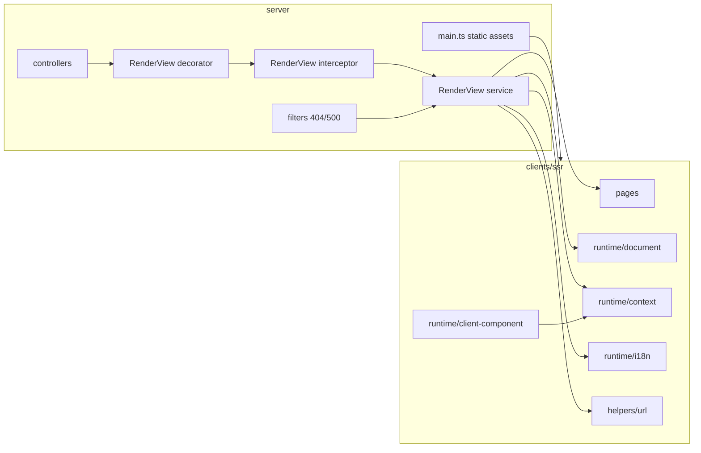

# React SSR 架构说明

## 目标

本架构用于支撑当前 CMS 前台页面的 React SSR 渲染，满足以下目标：

- 服务端统一通过 `@RenderView(PageComponent)` 输出页面
- 基于 React 18 做流式渲染
- 页面默认 SSR
- `'use client'` 组件采用“占位 + 浏览器首次挂载”
- 国际化基于 `i18next`
- 构建统一使用 `Rsbuild`

## 分层

### 1. 页面工程层 `clients/ssr`

职责：

- 维护所有前台 SSR 页面
- 提供页面组件导出
- 提供 SSR/CSR 共用 runtime
- 生成浏览器端静态资源与服务端 bundle

关键目录：

- `clients/ssr/src/pages`
- `clients/ssr/src/runtime`
- `clients/ssr/src/components`
- `clients/ssr/src/layouts`

### 2. 服务端接入层 `server/src/modules/render_view`

职责：

- 将控制器返回值转换为页面渲染输入
- 管理 SSR 流式输出
- 注入全局配置、翻译资源、当前用户与静态资源
- 统一处理 SSR 错误页

关键文件：

- `render_view.decorator.tsx`
- `render_view.interceptor.ts`
- `render_view.service.tsx`

### 3. 业务控制器层

职责：

- 负责业务数据查询
- 返回页面 `pageData`
- 不关心 HTML 拼装细节

典型文件：

- `home.controller.tsx`
- `news.controller.tsx`
- `public_article.controller.tsx`
- `user_client.controller.tsx`

### 4. 错误处理层

职责：

- 区分 API 请求与页面请求
- API 请求返回 JSON 错误
- 页面请求内部改写到 `/404` 或 `/500` 对应 SSR 页面

关键文件：

- `common/filters/not-found.filter.tsx`
- `common/filters/all-exceptions.filter.ts`

## 请求链路

### 正常页面请求

1. 浏览器请求页面路由，例如 `/news`
2. Nest 命中控制器方法
3. `@RenderView(PageComponent)` 将页面组件写入 metadata
4. 控制器返回普通对象作为 `pageData`
5. `RenderViewInterceptor` 拦截响应并交给 `RenderViewService`
6. `RenderViewService` 构建请求级渲染上下文
7. `RenderViewService` 使用 `renderToPipeableStream` 输出 HTML
8. 浏览器收到首屏 HTML
9. 浏览器加载 `clients/ssr/dist/web` 中的 JS/CSS
10. `'use client'` 组件扫描占位节点并执行首次挂载

### 错误页面请求

1. 页面请求在路由匹配或 SSR 过程中异常
2. 过滤器判断这是前台页面请求而不是 `/api/*`
3. 内部改写为 `NotFoundPage` 或 `InternalServerErrorPage`
4. 继续走 `RenderViewService` 输出 SSR HTML

## `'use client'` 组件机制

### 构建期

`clients/ssr/rsbuild.config.mts` 中的自定义插件会：

- 识别文件首行 `'use client'`
- 在 `node` 环境把导出替换成客户端组件引用
- 在 `web` 环境注册真实客户端组件到运行时注册表

### 服务端阶段

服务端不会执行 `'use client'` 组件真实逻辑，而是输出：

- 组件标识
- 编码后的 props
- 占位 DOM 节点

### 浏览器阶段

浏览器入口 `clients/ssr/src/client.tsx` 会：

- 读取 `__CMS_SSR_DATA__`
- 扫描客户端组件占位节点
- 从注册表找到真实组件
- 用 `createRoot(...).render(...)` 执行挂载

## 国际化架构

### 数据来源

- 语言识别：`getReqLang()`
- 系统翻译：`system_translation`
- 全局配置：`business_config`

### 服务端

`RenderViewService` 在请求期间注入：

- `lang`
- `translations`
- `globalData`
- `t()`

### 客户端

页面通过：

- `AppProvider`
- `I18nProvider`
- `useT()`
- `useLang()`

访问当前语言环境。

可运行参考：

- `/ssr-examples/i18n` 页面同时演示了 SSR 页面里的 `t()` 和共享组件里的 `useT()` / `useLang()`

## 静态资源注入

### 产物

`clients/ssr build` 会输出：

- `dist/node/index.js`
- `dist/web/manifest.json`
- `dist/web/static/js/*`
- `dist/web/static/css/*`

### 服务端读取方式

`RenderViewService` 读取 `manifest.json` 后：

- 注入 CSS `<link>`
- 注入 JS `<script defer>`

`server/src/main.ts` 将 `clients/ssr/dist/web` 挂载到：

- `/_fe_/`

可运行参考：

- `/ssr-examples/assets` 会直接引用 `/ssr-examples-cover.svg`
- 页面数据里也会显式展示 `/_fe_/manifest.json` 和 `/uploadfile` 两类资源入口

## 示例能力映射

当前示例页套件 `/ssr-examples*` 对应的能力分层如下：

- 国际化：
  - 服务端通过 `RenderViewService` 注入 `lang`、`translations`、`t()`
  - 页面与共享组件通过 `useT()` / `useLang()` 复用同一份上下文
  - 对应页面：`/ssr-examples/i18n`
- 资源引用：
  - `HtmlDocument` 负责注入 manifest 对应的 CSS/JS
  - 页面组件可以直接引用 `public/*` 暴露的静态文件，并结合 `/_fe_/` 资源前缀展示运行时资源入口
  - 对应页面：`/ssr-examples/assets`
- 复杂 client 组件：
  - `runtime/client-component.tsx` 负责占位节点扫描与 `createRoot(...).render(...)`
  - 示例页中的 dashboard 展示了本地状态、异步刷新、错误态、重试，以及 `useDeferredValue` / `startTransition`
  - 对应页面：`/ssr-examples/client-islands`
- 懒加载组件：
  - 懒加载发生在 `'use client'` 组件内部
  - 通过 `React.lazy` + `Suspense` 在浏览器挂载后拉取二级 chunk
  - 对应页面：`/ssr-examples/client-islands`
- 浏览器 API / 表单：
  - `localStorage`、`navigator`、`location`、`clipboard` 等能力全部放在 `'use client'` 组件内部
  - 示例页中的 lab 区块展示了 hydration 后的表单持久化与浏览器环境读取
  - 对应页面：`/ssr-examples/browser-apis`
- 客户端错误边界：
  - 只保护浏览器端 client 组件渲染
  - 不改变 SSR 主页面的服务端输出
  - 对应页面：`/ssr-examples/boundaries`、`/ssr-examples/browser-apis`

## Mermaid 架构图

```mermaid
flowchart TD
    A[Browser Request] --> B[Nest Controller]
    B --> C[@RenderView(PageComponent)]
    C --> D[RenderViewInterceptor]
    D --> E[RenderViewService]

    E --> F[Load pageData from controller]
    E --> G[Resolve lang via getReqLang]
    E --> H[Load globalData and translations]
    E --> I[Read manifest from clients/ssr/dist/web]

    F --> J[Compose PageComponentProps]
    G --> J
    H --> J

    J --> K[renderToPipeableStream]
    I --> K

    K --> L[HTML Stream Response]
    L --> M[Browser receives SSR HTML]
    M --> N[Load /_fe_/static/js and css]
    N --> O[Scan client component placeholders]
    O --> P[createRoot(...).render(...) mount]

    Q[NotFoundFilter] --> E
    R[AllExceptionsFilter] --> E
```

## 模块关系图



## 当前限制

1. `'use client'` 组件不输出服务端 HTML。
2. 不支持 React Server Components。
3. 不做局部 hydrate。
4. 页面 meta 目前仍是轻量注入，不是完整 SEO 管理框架。

## 后续建议

- 给 `RenderViewService` 增加更严格的页面 meta 接口
- 为客户端组件 props 增加序列化校验
- 增加 SSR E2E 测试
- 为 `clients/ssr` 增加页面级 manifest 或按页资源切分策略
